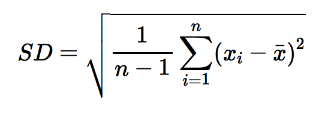
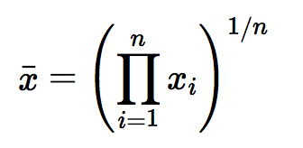

Lab 8: Programming Part 2
================
Gaston Sanchez

> ### Learning Objectives
> 
>   - Get familiar with the syntax of a `while` loop
>   - Get familiar with the syntax of a `repeat` loop
>   - Introduction to the R package “testthat”
>   - Write simple functions and their unit tests
>   - Test your code

### General Instructions

The purpose of this lab is two-fold:

1)  Keep practicing loops, and writing simple functions (you do NEED to
    submit Rmd and html files for this part).

2)  Getting started with writing tests for your functions (you don’t
    need to submit any files for this part).

<!-- end list -->

  - Write your descriptions, explanations, and code in an `Rmd` (R
    markdown) file.
  - Name this file as `lab08-first-last.Rmd`, where `first` and `last`
    are your first and last names (e.g. `lab08-gaston-sanchez.Rmd`).
  - Knit your `Rmd` file as an html document (default option).
  - Submit your `Rmd` and `html` files to bCourses, in the corresponding
    lab assignment.
  - Due date displayed in the syllabus (see github repo).

-----

## Your Turn: Average

The average of \(n\) numbers \(x_1, x_2, \dots, x_n\) is given by the
following formula:


\[
\bar{x} = \frac{1}{n} \sum_{i=1}^{n} x_i = \frac{x_1 + x_2 + \dots + x_n}{n}
\]

Write R code, using each type of loop (e.g. `for`, `while`, `repeat`) to
implement the arithmetic mean of the vector `x = 1:100`

## Your Turn: Standard Deviation

The sample standard deviation of a list of \(n\) numbers
\(x_1, x_2, \dots, x_n\) is given by the following formula:



\[
SD = \sqrt{ \frac{1}{n-1} \sum_{i=1}^{n} (x_i - \bar{x})^2 }
\]

Write R code, using each type of loop (e.g. `for`, `while`, `repeat`) to
implement the sample standard deviation of the vector `x = 1:100`

## Your Turn: Geometric Mean

The geometric mean of \(n\) numbers \(x_1, x_2, \dots, x_n\) is given by
the following formula:



\[
\bar{x} = \left ( \prod_{i=1}^{n} x_i \right )^{1/n}
\]

Write R code, using each type of loop (e.g. `for`, `while`, `repeat`) to
implement the geometric mean of the vector `x = 1:50`

-----

## Your Turn: Distance Matrix of Letters

The following code generates a random matrix `distances` with arbitrary
distance values among letters in English:

``` r
# random distance matrix
num_letters <- length(LETTERS)
set.seed(123)
values <- sample.int(num_letters) 
distances <- values %*% t(values)
diag(distances) <- 0
dimnames(distances) <- list(LETTERS, LETTERS)
```

The first 5 rows and columns of `distances` are:

``` r
distances[1:5, 1:5]
```

    ##     A   B   C   D   E
    ## A   0 160  80 168 184
    ## B 160   0 200 420 460
    ## C  80 200   0 210 230
    ## D 168 420 210   0 483
    ## E 184 460 230 483   0

Consider the following character vector `vec <- c('E', 'D', 'A')`. The
idea is to use the values in matrix `distances` to compute the total
distance between the letters: that is from `E` to `D`, and then from `D`
to `A`:

``` r
# (E to D) + (D to A)
483 + 168
```

    ## [1] 651

Hence, you can say that the letters in the word `'E' 'D' 'A'` have a
total distance value of 651.

### Your Turn:

Write a function `get_dist()` that takes two inputs:

  - `distances` = the matrix of distance among letters.
  - `ltrs` = a character vector of upper case letters.

The function must return a numeric value with the total distance. Also,
include a stopping condition—via `stop()`—for when a value in `ltrs`
does not match any capital letter. The error message should be
`"Unrecognized character"`

Here’s an example of how you should be able to invoke `get_dist()`:

``` r
vec <- c('E', 'D', 'A')
get_dist(distances, vec)
```

And here’s an example that should raise an error:

``` r
err <- c('E', 'D', ')')
get_dist(distances, err)
```

Test your function with the following character vectors:

  - `cal <- c('C', 'A', 'L')`
  - `stats <- c('S', 'T', 'A', 'T', 'S')`
  - `oski <- c('O', 'S', 'K', 'I')`
  - `zzz <- rep('Z', 3)`
  - `lets <- LETTERS`
  - a vector `first` with letters for your first name, e.g. `c('G', 'A',
    'S', 'T', 'O', 'N')`
  - a vector `last` for your last name, e.g. `c('S', 'A', 'N', 'C', 'H',
    'E', 'Z')`

**Your turn:** Assuming that you already created the objects listed
above, now create an R list `strings` like this:

``` r
# use your own 'first' and 'last' objects
strings <- list(
  cal = cal,
  stats = stats,
  oski = oski,
  zzz = zzz,
  lets = lets,
  first = first,
  last = last
)
```

Write a `for()` loop to iterate over the elements in `strings`, and
compute their distances. At each iteration, store the calculated
distances in a list called `strings_dists`; this list should have the
same names as `strings`.

How does your list `strings_dists` look like?

-----

## R package `"testthat"`

`"testthat"` is one of the packages in R that helps you write tests for
your functions. First, remember to install the package:

``` r
# do not include this code in your Rmd
# execute this in your console
install.packages("testthat")
```

  - `"testthat"` provides a testing framework for R that is easy to
    learn and use
  - `"testthat"` has a hierarchical structure made up of:
      - expectations
      - tests
      - contexts
  - A **context** involves **tests** formed by groups of
    **expectations**
  - Each structure has associated functions:
      - `expect_that()` for expectations
      - `test_that()` for groups of tests
      - `context()` for contexts

<!-- end list -->

``` r
# load testthat
library(testthat)
```

### List of common expectation functions

| Function                  | Description                                   |
| ------------------------- | --------------------------------------------- |
| `expect_true(x)`          | expects that `x` is `TRUE`                    |
| `expect_false(x)`         | expects that `x` is `FALSE`                   |
| `expect_null(x)`          | expects that `x` is `NULL`                    |
| `expect_type(x)`          | expects that `x` is of type `y`               |
| `expect_is(x, y)`         | expects that `x` is of class `y`              |
| `expect_length(x, y)`     | expects that `x` is of length `y`             |
| `expect_equal(x, y)`      | expects that `x` is equal to `y`              |
| `expect_equivalent(x, y)` | expects that `x` is equivalent to `y`         |
| `expect_identical(x, y)`  | expects that `x` is identical to `y`          |
| `expect_lt(x, y)`         | expects that `x` is less than `y`             |
| `expect_gt(x, y)`         | expects that `x` is greater than `y`          |
| `expect_lte(x, y)`        | expects that `x` is less than or equal to `y` |
| `expect_gte(x, y)`        | expects that `x` is greater than or equal `y` |
| `expect_named(x)`         | expects that `x` has names `y`                |
| `expect_matches(x, y)`    | expects that `x` matches `y` (regex)          |
| `expect_message(x, y)`    | expects that `x` gives message `y`            |
| `expect_warning(x, y)`    | expects that `x` gives warning `y`            |
| `expect_error(x, y)`      | expects that `x` throws error `y`             |

-----

## Part 2) Practice writing simple tests

  - To start the practice, create a new directory, e.g. `lab09`
  - `cd` to `lab09`
  - Create an `R` script to write and document your functions:
    e.g. `functions.R`
  - Create a separate `R` script `tests.R` to write the tests of your
    functions.
  - Below is the filestructure for this part of the lab assignment

<!-- end list -->

``` 
  lab09/
    functions.R
    tests.R
```

### Example with `stat_range()`

Let’s start with a basic function `stat_range()` to compute the overall
range of a numeric vector. Create this function in the file
`functions.R`.

``` r
#' @title Range
#' @description computes the range of a numeric vector (i.e. max - min)
#' @param x a numeric vector
#' @return the range value (max - min)
stat_range <- function(x) {
  max(x) - min(x)
}
```

### Tests for `stat_range()`

To write the unit tests in `tests.R`, we are going to consider the
following testing vectors:

  - `x <- c(1, 2, 3, 4, 5)`
  - `y <- c(1, 2, 3, 4, NA)`
  - `z <- c(TRUE, FALSE, TRUE)`
  - `w <- letters[1:5]`

The typical structure of the tests has the following form:

``` r
# load the source code of the functions to be tested
source("functions.R")

# context with one test that groups expectations
context("Test for range value") 

test_that("range works as expected", {
  x <- c(1, 2, 3, 4, 5)
  
  expect_equal(stat_range(x), 4)
  expect_length(stat_range(x), 1)
  expect_type(stat_range(x), 'double')
})
```

  - use `context()` to describe what the test are about
  - use `test_that()` to group expectations:
      - output equal to 4
      - output of length one
      - output of type `double`
  - to run the tests from the R console, use the function `test_file()`
    by passing the path of the file `tests.R`

<!-- end list -->

``` r
# assuming that your working directory is "lab09/"
library(testthat)
test_file("tests.R")
```

You could actually include a code chunk in your Rmd with the code above.

### Your Turn

Write more groups of tests—`test_that()`—to test `stat_range()` with the
rest of the testing vectors `y`, `z`, `w`:

  - Using `y`, write expectations for:
      - output is of length one
      - output is equal to `NA_real_`
  - Using `z`, write expectations for:
      - output is of length one
      - output is of type `integer`
      - output is equal to `1L`
  - Using `w`, write expectations for:
      - throws an error

Try writing the following functions and come up with unit tests:

  - `stat_centers()`
      - *title:* measures of center
      - *description:* computes measures of center such as Median and
        Mean
      - *param:* a numeric vector
      - *return:* a numeric vector with median and mean
      - use `mean()` and `median()` to write `stat_centers()`
  - `stat_spreads()`
      - *title:* measures of spread
      - *description:* computes measures of spread such as Range, IQR,
        Standard Deviation
      - *param:* a numeric vector
      - *return:* a numeric vector with range, iqr, and stdev
      - use `stat_range()`, `IQR()`, and `sd()` to write
        `stat_spreads()`
